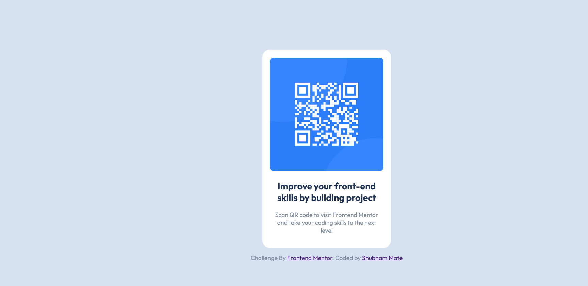

# Frontend Mentor - QR code component solution

This is a solution to the [QR code component challenge on Frontend Mentor](https://www.frontendmentor.io/challenges/qr-code-component-iux_sIO_H). Frontend Mentor challenges help you improve your coding skills by building realistic projects. 

## Table of contents

- [Overview](#overview)
  - [Screenshot](#screenshot)
  - [Links](#links)
- [Built with](#built-with)
- [Author](#author)

**Note: Delete this note and update the table of contents based on what sections you keep.**

## Overview

### Screenshot

### Links

- Solution URL: [Here](https://www.frontendmentor.io/solutions/qrcodecomponent-using-css-flexbox-UJCXYV3L0z)
- Live Site URL: [Here](https://shubham-mate.github.io/QR-Code-Component/)

### Built with

- Semantic HTML5 markup
- CSS custom properties
- Flexbox

## Author

- Website - [Shubham Mate](https://github.com/Shubham-Mate)
- Frontend Mentor - [@Shubham-Mate](https://www.frontendmentor.io/profile/Shubham-Mate)

